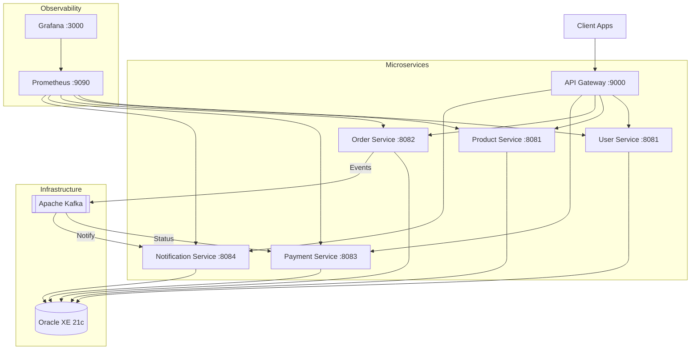

# ☁️ Cloud Commerce Backend - Microservices Architecture

[](https://www.oracle.com/java/)
[](https://spring.io/projects/spring-boot)
[](https://www.docker.com/)
[](https://kafka.apache.org/)
[](https://www.oracle.com/database/)
[](LICENSE)

A state-of-the-art, cloud-native e-commerce backend built with **Spring Boot 3** and **Java 21**. This project demonstrates a robust microservices architecture, implementing industry best practices for scalability, asynchronous communication, and observability.

---

## 🏗️ System Architecture

The project follows a distributed microservices pattern, orchestrated via **Docker Compose** and utilizing **Spring Cloud Gateway** as the single entry point.



---

## 🚀 Key Features

- **Microservices Orchestration**: Fully containerized environment using **Multi-stage Docker builds** for optimized images.
- **Asynchronous Architecture**: Event-driven communication between Order, Payment, and Notification services via **Apache Kafka**.
- **Centralized Gateway**: Secure and efficient routing using **Spring Cloud Gateway**.
- **Observability Stack**: Integrated metrics collection with **Micrometer**, **Prometheus**, and visualization with **Grafana**.
- **Shared Domain Logic**: Custom `common-lib` for shared DTOs, exceptions, and utility classes.
- **Enterprise Database**: High-performance data persistence with **Oracle Database 21c**.

---

## 🛠️ Technology Stack

| Category | Technology |
| :--- | :--- |
| **Language** | Java 21 (LTS) |
| **Framework** | Spring Boot 3.2.3, Spring Data JPA |
| **Microservices** | Spring Cloud Gateway, OpenFeign |
| **Messaging** | Apache Kafka |
| **Database** | Oracle XE 21c, H2 (Testing) |
| **Containerization**| Docker, Docker Compose |
| **Monitoring** | Prometheus, Grafana, Actuator |
| **Libraries** | Lombok, MapStruct (if applicable), JUnit 5, Mockito |

---

## 📦 Service Breakdown

- **`api-gateway`**: Central entry point. Handles routing and cross-cutting concerns.
- **`user-service`**: Manages user registration, authentication, and profiles.
- **`product-service`**: Catalog management, inventory tracking, and search.
- **`order-service`**: Core business logic for order placement and lifecycle.
- **`payment-service`**: Processing transactions and financial integrations.
- **`notification-service`**: Async delivery of emails/alerts via Kafka consumers.
- **`common-lib`**: Reusable components and shared models.

---

## 🚦 Getting Started

### Prerequisites

- [Docker Desktop](https://www.docker.com/products/docker-desktop)
- [Git](https://git-scm.com/)

### Running the Entire Stack

The project is configured with **multi-stage builds**, meaning you don't need Java or Maven installed locally!

1. Clone the repository:
   ```bash
   git clone https://github.com/YOUR_USER/cloud-commerce-backend.git
   cd cloud-commerce-backend
   ```

2. Spin up the containers:
   ```bash
   docker-compose up -d --build
   ```

3. Access the Gateway at: `http://localhost:9000`

---

## 📊 Monitoring & Observability

- **Prometheus**: View collected metrics at `http://localhost:9090`
- **Grafana**: Interactive dashboards at `http://localhost:3000` (Default: admin/admin)
- **Actuator**: Every service exposes `/actuator/health` and `/actuator/prometheus`

---

## 🤝 Contributing

Contributions are welcome! Please feel free to submit a Pull Request.

---

## 📄 License

Distributed under the MIT License. See `LICENSE` for more information.

---

**Developed by [Your Name]** - *Software Engineer specialized in Cloud-Native Solutions.*
